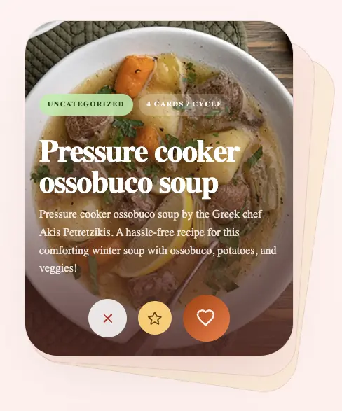
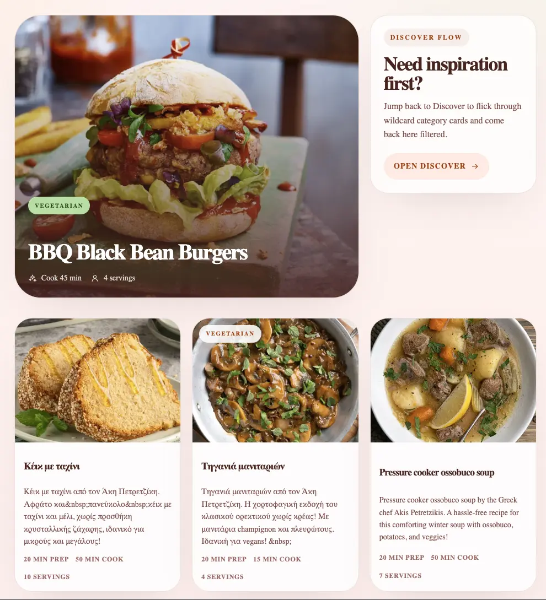
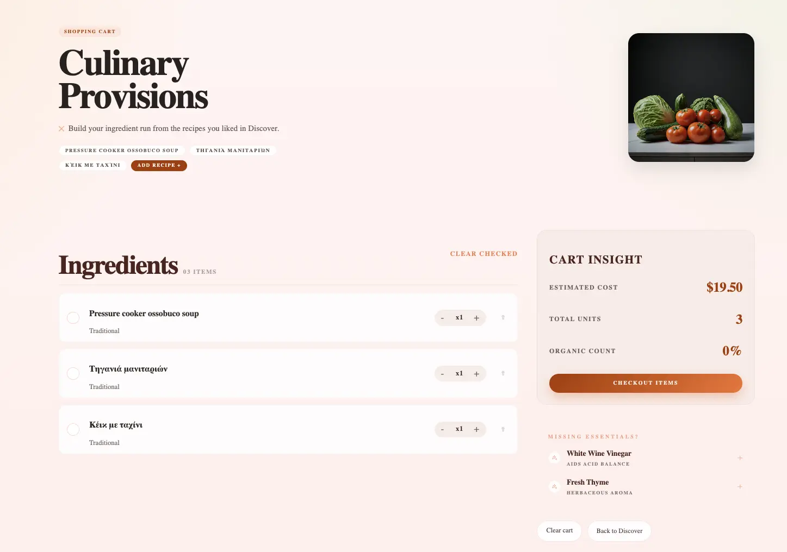

# Recipe Swipe

A modern recipe app built with Next.js and Sanity, focused on fast recipe discovery, rich recipe detail pages, and a practical ingredient cart workflow.

## Highlights

- Swipe-style discovery flow for exploring recipes
- Category-aware recipe cards and browsing
- Recipe detail pages with ingredients and instructions
- Ingredient/cart page with quantity controls and check states
- Sanity-powered content model for recipes, categories, and ingredients
- Recipe import flow to speed up content creation

## Screenshots

### Discover



### Recipe book



### Shopping Cart



## Tech Stack

- **Framework:** Next.js 16, React 19, TypeScript
- **CMS:** Sanity (`next-sanity`, `@sanity/image-url`)
- **Styling:** CSS Modules (+ Sass available)
- **Runtime/Env:** Varlock integration for typed env loading

## App Routes

- `/` — Discover
- `/recipes` — Recipes listing
- `/recipe/[slug]` — Recipe detail
- `/cart` — Ingredient cart
- `/import` — Recipe import
- `/studio` — Sanity Studio

## Getting Started

### 1) Install dependencies

```bash
pnpm install
```

### 2) Configure environment

Create `.env.local` in the project root:

```bash
NEXT_PUBLIC_SANITY_PROJECT_ID=your_project_id
NEXT_PUBLIC_SANITY_DATASET=your_dataset
SANITY_WRITE_TOKEN=your_sanity_write_token
```

### 3) Run the app

```bash
pnpm run dev
```

Open app at http://localhost:3000
Open sanity studio at http://localhost:3000/studio
